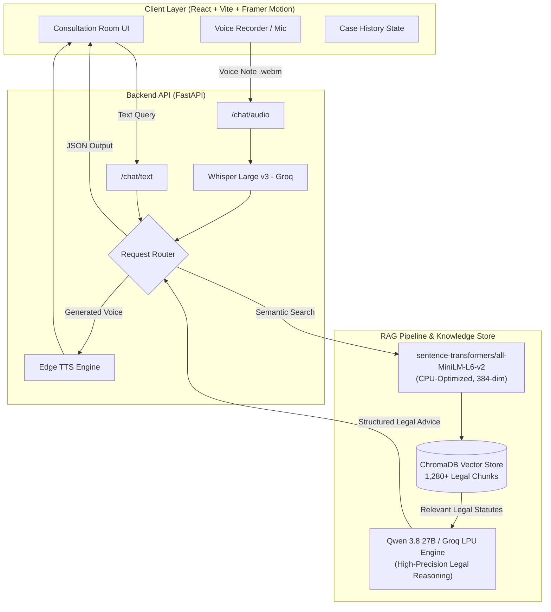

# ⚖️ Haqooq AI — Pakistani Legal Advisor AI Agent

<div align="center">

[](https://github.com/osamanoor17/haqooq)
[](https://fastapi.tiangolo.com/)
[](https://reactjs.org/)
[](https://groq.com/)
[](https://www.trychroma.com/)
[](https://python.org/)

**Empowering 240+ million citizens with instant, accurate, and 100% confidential legal guidance under Pakistani Law.**

[Explore Features](#-core-capabilities) • [System Architecture](#-system-architecture) • [Legal Coverage](#-legal-datasets--acts-covered) • [Quick Start](#-quick-start-guide) • [API Reference](#-api-endpoints)

</div>

---

## 📖 The Vision Behind Haqooq AI

In Pakistan, accessing quality legal counsel is often intimidating, geographically inaccessible, and financially prohibitive for the average citizen. Whether it involves filing an FIR against police refusal, understanding cyber harassment under PECA 2016, or navigating family disputes under the Muslim Family Laws Ordinance, citizens frequently fall victim to misinformation.

**Haqooq AI** (*حُقوق* — meaning *"Rights"* in Urdu) bridges this justice gap. It acts as an **intelligent, bilingual first-responder AI legal consultant** that cites actual enacted Pakistani statutes, provides step-by-step procedural roadmaps, details required evidentiary documents, and generates clickable legal references.

---

## 🎯 Core Capabilities

- 🔍 **Strict RAG (Retrieval-Augmented Generation):** Backed by a dense vector database of Pakistani Acts. The agent **never hallucinates**; it explicitly cites specific sections (e.g., *Section 154 CrPC*, *Section 489-F PPC*, *Section 21 PECA 2016*).
- 🗣️ **Trilingual Fluency:** Seamlessly comprehends and replies in **Pure English**, **Roman Urdu** (*"meri bike chori hogyi"*), or **Proper Urdu Script** (*"میرا مسئلہ یہ ہے"*).
- 🎙️ **Voice Consultation Room:** Integrated with `whisper-large-v3` for speech transcription and `edge-tts` for natural Pakistani voice responses (`ur-PK-UzmaNeural`).
- 📁 **Multi-Session Case Management:** Create, manage, and switch between separate consultation sessions with auto-titling and transcript export.
- ⚡ **Ultra-Lightweight & CPU-Optimized:** Engineered with `all-MiniLM-L6-v2` and thread-controlled PyTorch execution, ensuring **sub-second responses** with minimal CPU/RAM footprint and zero laptop heatup.
- 🛡️ **Strict Non-Legal Refusal:** Built-in safeguards reject non-legal queries (e.g., cooking recipes or general chat) to maintain legal integrity.

---

## 🏗️ System Architecture



---

## 📊 Legal Datasets & Acts Covered

Haqooq AI is grounded in verified, structured Pakistani legal databases:

| Act / Statute | Key Domains Covered | Practical Examples |
| :--- | :--- | :--- |
| **Pakistan Penal Code (PPC 1860)** | Criminal offenses, theft, robbery, fraud, dishonest cheques | Section 378/379 (Theft), Section 489-F (Dishonored Cheque), Section 420 (Cheating) |
| **Code of Criminal Procedure (CrPC 1898)** | Police powers, FIR registration, bail, Justice of Peace | Section 154 (Mandatory FIR), Section 22-A/22-B (Ex-Officio Justice of Peace), Section 497/498 (Bail) |
| **PECA 2016 & FIA Rules** | Cybercrime, unauthorized access, online harassment, blackmail | Section 14 (Unauthorized identity info), Section 20/21 (Cyberstalking & dignity of natural person) |
| **Muslim Family Laws Ordinance 1961** | Marriage, Talaq, Khula, Maintenance, Succession | Section 7 (Talaq Notice to Union Council), Section 9 (Wife & Child Maintenance) |
| **Limitation Act 1908** | Statutory deadlines for filing suits, appeals, and petitions | Period of limitation for recovery, civil appeals, and revisions |

---

## 🛠️ Tech Stack & Engineering Highlights

- **Frontend:** React 18, Vite, Framer Motion, Lucide Icons, React Markdown, Remark GFM.
- **Backend Framework:** FastAPI (Python 3.9+ / 3.13 ready) with non-blocking threadpool offloading.
- **Vector Database:** ChromaDB with persistent SQLite storage.
- **Embedding Model:** `sentence-transformers/all-MiniLM-L6-v2` (~80 MB, 22M params) with single-thread threadpool pinning (`torch.set_num_threads(1)`) to eliminate CPU spikes.
- **Inference Engine:** `qwen/qwen3.8-27b` via **Groq Cloud API** for ultra-fast, token-efficient legal synthesis.
- **Speech-to-Text:** `whisper-large-v3` with custom script detection for Urdu and English audio.
- **Text-to-Speech:** Microsoft `edge-tts` streaming natural Pakistani Urdu (`ur-PK-UzmaNeural`) and English (`en-US-AriaNeural`).

---

## 🚀 Quick Start Guide

### Prerequisites
- Python 3.9+ installed
- Node.js (v18+) & npm installed
- Free API key from [Groq Console](https://console.groq.com/)

---

### 1️⃣ Clone & Configure Environment

```bash
# Clone the repository
git clone https://github.com/osamanoor17/haqooq.git
cd haqooq

# Create and activate Python virtual environment
python -m venv venv
venv\Scripts\activate      # On Windows
# source venv/bin/activate  # On Linux/macOS
```

Create a `.env` file in the project root:

```env
GROQ_API_KEY=gsk_your_groq_api_key_here
CHROMA_PERSIST_DIR=./data/chroma_db
```

---

### 2️⃣ Ingest Legal Datasets (One-Time Setup)

Ingest Pakistani legal statutes into your local ChromaDB:

```bash
pip install -r requirements.txt
python -m data.ingest
```
*✨ Takes ~15–30 seconds to parse, chunk, and embed all legal acts.*

---

### 3️⃣ Start Backend Server

```bash
python -m uvicorn backend.api:app --reload --port 8000
```
Backend will be live at: `http://127.0.0.1:8000` (Swagger UI at `/docs`).

---

### 4️⃣ Start Frontend Application

Open a **second terminal** tab:

```bash
cd frontend
npm install
npm run dev
```
Open **[http://localhost:5173](http://localhost:5173)** in your browser.

---

## 🔌 API Endpoints

### 1. Text Consultation
- **Endpoint:** `POST /chat/text`
- **Payload:**
  ```json
  {
    "message": "Someone issued a fake check that bounced. What can I do under Section 489-F PPC?",
    "history": []
  }
  ```
- **Response:**
  ```json
  {
    "response": "Under Section 489-F of the Pakistan Penal Code...",
    "audio": null
  }
  ```

### 2. Voice Consultation
- **Endpoint:** `POST /chat/audio`
- **Payload:** `multipart/form-data` with `audio` (.webm/.wav file) and `history` (JSON string).
- **Response:**
  ```json
  {
    "transcription": "Mera WhatsApp hack hogya hai...",
    "response": "PECA 2016 ke Section 14 aur 21 ke tehat...",
    "audio": "UklGRiQAAABXQVZFZm10IBAAAAAB..."
  }
  ```

---

## 🧪 Sample Queries to Try

| Category | Sample Query | Supported Language |
| :--- | :--- | :--- |
| **Cybercrime** | *"I was scammed in a WhatsApp group and lost money. Under which PECA sections can I report to FIA?"* | English |
| **Criminal Law** | *"Police station mein SHO FIR darj nahi kar raha, Sessions Court mein 22-A petition ka tareeqa batao."* | Roman Urdu |
| **Family Law** | *"فیملی کورٹ سے بچوں کا نان نفقہ اور خرچہ حاصل کرنے کے لیے کون سے کاغذات درکار ہیں؟"* | Urdu Script |
| **Cheque Fraud** | *"Bank se cheque bounce hone par 489-F PPC ke tehat FIR ka mukammal legal procedure kya hai?"* | Roman Urdu |
| **Safety Refusal** | *"Biryani ki recipe batao"* | Auto-Refusal |

---

## 🔮 Roadmap & Future Scope

- [ ] **WhatsApp Bot Integration:** Reach rural populations directly through WhatsApp voice notes.
- [ ] **High Court Cause-List Tracker:** Real-time integration with High Court APIs for automated hearing reminders.
- [ ] **Automated Legal Notice Generator:** Export ready-to-sign PDF notices (e.g., Section 7 Talaq notice or Section 154 police applications).
- [ ] **PWA / Mobile App Distribution:** 1-click install on Android & iOS via Capacitor.

---

## ⚖️ Legal Disclaimer

> [!IMPORTANT]
> **Haqooq AI** is an artificial intelligence-driven legal awareness platform designed to assist citizens in understanding Pakistani law. It **does not** constitute formal attorney-client representation. For complex litigation, representation in court, or formal proceedings, users are strongly advised to engage a licensed Advocate of the High Court / Supreme Court of Pakistan.

---

<div align="center">
Made with ❤️ for access to justice in Pakistan 🇵🇰
</div>
