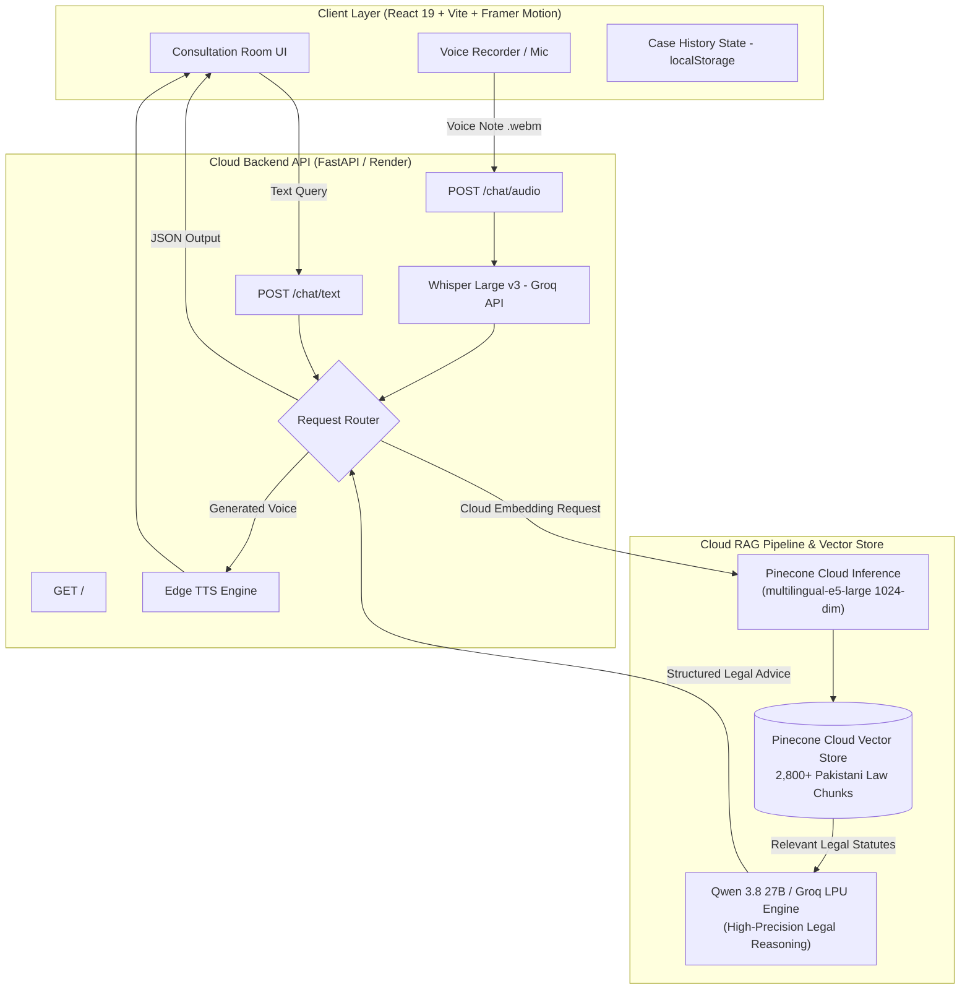

# ⚖️ Haqooq AI — Pakistani Legal Advisor AI Agent

<div align="center">

[](https://github.com/osamanoor17/haqooq)
[](https://fastapi.tiangolo.com/)
[](https://reactjs.org/)
[](https://www.pinecone.io/)
[](https://groq.com/)
[](https://render.com/)

**Empowering 240+ million citizens with instant, accurate, and 100% confidential legal guidance under Pakistani Law.**

[Explore Features](#-core-capabilities) • [System Architecture](#-system-architecture) • [Legal Coverage](#-legal-datasets--acts-covered) • [Quick Start](#-quick-start-guide) • [Live Deployment](#-cloud-deployment-render--vercel)

</div>

---

## 📖 The Vision Behind Haqooq AI

In Pakistan, accessing quality legal counsel is often intimidating, geographically inaccessible, and financially prohibitive for the average citizen. Whether it involves filing an FIR against police refusal, understanding cyber harassment under PECA 2016, or navigating family disputes under the Muslim Family Laws Ordinance, citizens frequently fall victim to misinformation.

**Haqooq AI** (*حُقوق* — meaning *"Rights"* in Urdu) bridges this justice gap. It acts as an **intelligent, bilingual first-responder AI legal consultant** that cites actual enacted Pakistani statutes, provides step-by-step procedural roadmaps, details required evidentiary documents, and generates clickable legal references.

---

## 🎯 Core Capabilities

- 🔍 **100% Cloud Serverless RAG:** Powered by **Pinecone Cloud Vector DB** (`multilingual-e5-large` 1024-dim embeddings). Zero local CPU/GPU/RAM overhead; **never hallucinates** and explicitly cites specific sections (e.g., *Section 154 CrPC*, *Section 489-F PPC*, *Section 16 PECA 2016*).
- 🗣️ **Trilingual Fluency:** Seamlessly comprehends and replies in **Pure English**, **Roman Urdu** (*"meri bike chori hogyi"*), or **Proper Urdu Script** (*"میرا مسئلہ یہ ہے"*).
- 🎙️ **Voice Consultation Room:** Integrated with `whisper-large-v3` via Groq for speech transcription and `edge-tts` for natural Pakistani voice responses (`ur-PK-UzmaNeural`).
- 📁 **Persistent Case Session Management:** Multi-session case management stored cleanly in browser `localStorage` across refreshes, complete with 1-click text case transcript export.
- 🎨 **High-Class SaaS UI:** Clean, spacious, and modern interface with dynamic light mode, theme toggle (☀️/🌙), interactive starter scenario cards, and statutory law coverage grid.
- ⚡ **Lightning Fast Speed:** Sub-second retrieval and legal advice synthesis using Groq's LPU acceleration engines.

---

## 🏗️ System Architecture



---

## 📊 Legal Datasets & Acts Covered

Haqooq AI is grounded in verified, structured Pakistani legal databases:

| Act / Statute | Key Domains Covered | Practical Examples |
| :--- | :--- | :--- |
| **Pakistan Penal Code (PPC 1860)** | Criminal offenses, theft, robbery, fraud, dishonest cheques | Section 378/379 (Theft), Section 489-F (Dishonored Cheque), Section 420 (Cheating) |
| **Code of Criminal Procedure (CrPC 1898)** | Police powers, FIR registration, bail, Justice of Peace | Section 154 (Mandatory FIR), Section 22-A/22-B (Ex-Officio Justice of Peace), Section 497/498 (Bail) |
| **PECA 2016 & FIA Rules** | Cybercrime, unauthorized access, online harassment, blackmail | Section 14 (Unauthorized identity info), Section 16 (Cyber fraud), Section 20/21 (Cyberstalking) |
| **Muslim Family Laws Ordinance 1961** | Marriage, Talaq, Khula, Maintenance, Succession | Section 7 (Talaq Notice to Union Council), Section 9 (Wife & Child Maintenance) |
| **Transfer of Property Act 1882** | Land ownership, lease agreements, tenant eviction notices | Sale of property, tenancy eviction procedures |

---

## 🛠️ Tech Stack & Engineering Highlights

- **Frontend:** React 19, Vite, Framer Motion, Lucide Icons, React Markdown, Remark GFM.
- **Backend Framework:** FastAPI (Python 3.11 / 3.13 ready) with CORS security and root health check routes.
- **Vector Database:** Pinecone Serverless Cloud Vector Store (`haqooq-legal-db`).
- **Embedding Model:** Pinecone Cloud Inference `multilingual-e5-large` (1024-dim, 100% Zero-RAM Cloud Execution).
- **Inference Engine:** `qwen/qwen3.8-27b` via **Groq Cloud API** for ultra-fast, token-efficient legal synthesis.
- **Speech-to-Text:** `whisper-large-v3` with script auto-detection for Urdu and English audio.
- **Text-to-Speech:** Microsoft `edge-tts` streaming natural Pakistani Urdu (`ur-PK-UzmaNeural`) and English (`en-US-AriaNeural`).

---

## 🚀 Quick Start Guide

### Prerequisites
- Python 3.11+ installed
- Node.js (v18+) & npm installed
- Free API key from [Groq Console](https://console.groq.com/)
- Free API key from [Pinecone Console](https://app.pinecone.io/)

---

### 1️⃣ Clone & Configure Environment

```bash
# Clone the repository
git clone https://github.com/osamanoor17/haqooq.git
cd haqooq

# Create and activate Python virtual environment
python -m venv venv
venv\Scripts\activate      # On Windows
# source venv/bin/activate  # On Linux/macOS
```

Create a `.env` file in the project root:

```env
GROQ_API_KEY=gsk_your_groq_api_key_here
PINECONE_API_KEY=pcsk_your_pinecone_api_key_here
PINECONE_INDEX_NAME=haqooq-legal-db
```

---

### 2️⃣ Cloud Data Ingestion (One-Time Setup)

Ingest Pakistani legal statutes into your Pinecone Cloud Index:

```bash
pip install -r requirements.txt
python data/ingest.py
```
*✨ Parses, chunks, and uploads all 2,800+ legal chunks directly to Pinecone Cloud.*

---

### 3️⃣ Start Backend Server

```bash
python -m uvicorn backend.api:app --reload --port 8000
```
Backend will be live at `http://127.0.0.1:8000` (Health check at `/`).

---

### 4️⃣ Start Frontend Application

Open a **second terminal**:

```bash
cd frontend
npm install
npm run dev
```
Open **[http://localhost:5173](http://localhost:5173)** in your browser.

---

## 🌐 Cloud Deployment (Render & Vercel)

### Backend Deployment (Render.com)
- **Runtime:** Docker (uses root `Dockerfile`)
- **Port:** 8000
- **Environment Variables:** `PINECONE_API_KEY`, `PINECONE_INDEX_NAME`, `GROQ_API_KEY`
- **Live URL:** `https://haqooq.onrender.com`

### Frontend Deployment (Vercel / Netlify)
- **Build Command:** `npm run build`
- **Output Directory:** `dist`
- **Environment Variable:** `VITE_API_URL=https://haqooq.onrender.com`

---

## 🔌 API Endpoints

### 1. Health Check
- **Endpoint:** `GET /`
- **Response:** `{"status": "online", "service": "Haqooq AI Legal Advisor API"}`

### 2. Text Consultation
- **Endpoint:** `POST /chat/text`
- **Payload:**
  ```json
  {
    "message": "Someone issued a fake check that bounced. What can I do under Section 489-F PPC?",
    "history": []
  }
  ```
- **Response:**
  ```json
  {
    "response": "Under Section 489-F of the Pakistan Penal Code...",
    "audio": null
  }
  ```

### 3. Voice Consultation
- **Endpoint:** `POST /chat/audio`
- **Payload:** `multipart/form-data` with `audio` (.webm/.wav file) and `history` (JSON string).
- **Response:**
  ```json
  {
    "transcription": "Mera WhatsApp hack hogya hai...",
    "response": "PECA 2016 ke Section 16 ke tehat...",
    "audio": "UklGRiQAAABXQVZFZm10IBAAAAAB..."
  }
  ```

---

## ⚖️ Legal Disclaimer

> [!IMPORTANT]
> **Haqooq AI** is an artificial intelligence-driven legal awareness platform designed to assist citizens in understanding Pakistani law. It **does not** constitute formal attorney-client representation. For complex litigation or representation in court, users are strongly advised to engage a licensed Advocate of the High Court / Supreme Court of Pakistan.

---

<div align="center">
Made with ❤️ for access to justice in Pakistan 🇵🇰
</div>
